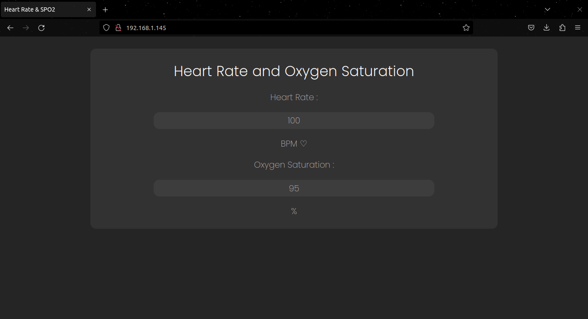

# Práctica 5. Gerard Cots y Joel J. Morera

## Ejercicio practico 1 : Escáner I2C

###### **Funcionamiento**

Este ejercicio consiste en realizar un programa que escanee los dispositivos conectados al procesador mediante el bus I2C. Para ello el procesador manda transmisiones a todas las direcciones posibles y, en caso de que haya un dispositivo en esa dirección, la respuesta a esta transmission sera un _Acknowledge_, que, en pocas palabras, siginifica que el dispositivo ha recibido la transmission y, por tanto, existe.

###### **Código del programa**

```cpp
#include <Arduino.h>
#include <Wire.h>

void setup()
{
  Wire.begin();
 
  Serial.begin(115200);
  while (!Serial);             // Wait for serial monitor
  Serial.println("\nI2C Scanner");
}
 
void loop()
{
  byte error, address;
  int nDevices;
 
  Serial.println("Scanning...");
 
  nDevices = 0;
  for(address = 1; address < 127; address++ )
  {
    // The i2c_scanner uses the return value of
    // the Write.endTransmisstion to see if
    // a device did acknowledge to the address.
    Wire.beginTransmission(address);
    error = Wire.endTransmission();
 
    if (error == 0)
    {
      Serial.print("I2C device found at address 0x");
      if (address<16)
        Serial.print("0");
      Serial.print(address,HEX);
      Serial.println("  !");
 
      nDevices++;
    }
    else if (error==4)
    {
      Serial.print("Unknown error at address 0x");
      if (address<16)
        Serial.print("0");
      Serial.println(address,HEX);
    }    
  }
  if (nDevices == 0)
    Serial.println("No I2C devices found\n");
  else
    Serial.println("done\n");
 
  delay(5000);           // wait 5 seconds for next scan
}
```

###### **Salida del puerto serie**

En la salida del puerto serie podemos ver la dirección de cada uno de los dispositivos I2C que se han encontrado:

```
Scanning...
I2C device found at address 0x39  !
I2C device found at address 0x3C  !
I2C device found at address 0x57  !
done
```

###### **Montaje**


***

## Ejercicio practico 2 : Utilización del pulsioximetro MAX30102

###### **Funcionamiento**

En el siguiente ejercicio se describe un programa para mostrar por pantalla las medidas que calcula el pulsioximetro MAX30102. En el codigo diferenciamos tres funciones principales: inicialización del dispositivos, determinar la velocidad de la señal y actulizar muestras.

En la inicialización del pulsioximetro definimos la velocidad de transimision a 400kHz y las variables recomendadas de configuración del sensor para conseguir los valores más precisos possibles.

Determinar la velocidad de la señal consiste en leer las 100 primeras muestras y guardarlas en dos _buffers_, uno para el led rojo y otro para el infrarojo. Seguidamente, calculamos la frecuencia cardiaca y la saturación de oxígeno en sangre y ponemos la orden de determinar la velocidad de la señal a 0.

Para actualizar las muestras, cosa que se hará cada segundo, primero descartamos las primeras 25 muestras, desplazamos el resto al inicio y leemos otras 25. Por último, volvemos a calular la frecuencia cardiaca y la saturación de oxígeno en sangre.

Todas las veces que se calculan nuevos valores son mostrados por pantalla, junto con un indicador que nos muestra la validez de cada valor.

###### **Código del programa**

- platformio.ini:

```
[env:esp32doit-devkit-v1]
platform = espressif32
board = esp32doit-devkit-v1
framework = arduino
monitor_speed = 115200
monitor_port = /dev/ttyUSB0
lib_deps =  sparkfun/SparkFun MAX3010x Pulse and Proximity Sensor Library@^1.1.2
```

- main.cpp:

```cpp
#include <Arduino.h>
#include <Wire.h>
#include "MAX30105.h"
#include "heartRate.h"
#include "spo2_algorithm.h"

MAX30105 particleSensor;

#define MAX_BRIGHTNESS 255

uint32_t irBuffer[100]; //infrared LED sensor data
uint32_t redBuffer[100];  //red LED sensor data

int32_t bufferLength; //data length
int32_t spo2; //SPO2 value
int8_t validSPO2; //indicator to show if the SPO2 calculation is valid
int32_t heartRate; //heart rate value
int8_t validHeartRate; //indicator to show if the heart rate calculation is valid

byte readLED = 13; //Blinks with each data read

bool DSR = true;

void initMAX30102();
void determineSignalRate();
void takingSamples();

void setup()
{
  Serial.begin(115200); // initialize serial communication at 115200 bits per second:

  pinMode(readLED, OUTPUT);

  initMAX30102();
}

void loop()
{
  if(DSR)determineSignalRate();
    
  Serial.print(F("\t Heart Rate : "));
  Serial.print(heartRate, DEC);

  Serial.print(F("\t HRvalid : "));
  Serial.print(validHeartRate, DEC);

  Serial.print(F("\t Saturation in oxygen : "));
  Serial.print(spo2, DEC);

  Serial.print(F("\t SPO2Valid : "));
  Serial.println(validSPO2, DEC);
  
  takingSamples();
}

void initMAX30102()
{
  // Initialize sensor
  if (!particleSensor.begin(Wire, I2C_SPEED_FAST)) //Use default I2C port, 400kHz speed
  {
    Serial.println(F("MAX30105 was not found. Please check wiring/power."));
    while (1);
  }
  
  byte ledBrightness = 60;  //Options: 0=Off to 255=50mA
  byte sampleAverage = 4;   //Options: 1, 2, 4, 8, 16, 32
  byte ledMode = 2;         //Options: 1 = Red only, 2 = Red + IR, 3 = Red + IR + Green
  byte sampleRate = 100;    //Options: 50, 100, 200, 400, 800, 1000, 1600, 3200
  int pulseWidth = 411;     //Options: 69, 118, 215, 411
  int adcRange = 4096;      //Options: 2048, 4096, 8192, 16384
  
  particleSensor.setup(ledBrightness, sampleAverage, ledMode, sampleRate, pulseWidth, adcRange); //Configure sensor with these settings
}

void determineSignalRate()
{
  bufferLength = 100; //buffer length of 100 stores 4 seconds of samples running at 25sps
  Serial.print("Determining signal rate ..");
  //read the first 100 samples, and determine the signal range
  for (byte i = 0 ; i < bufferLength ; i++)
  {
    while (particleSensor.available() == false) //do we have new data?
    
    particleSensor.check(); //Check the sensor for new data

    redBuffer[i] = particleSensor.getRed();
    irBuffer[i] = particleSensor.getIR();
    particleSensor.nextSample(); //We're finished with this sample so move to next sample
    if(i%25 == 0)
    {  
      Serial.print('.');
    }
  }
  //calculate heart rate and SpO2 after first 100 samples (first 4 seconds of samples)
  maxim_heart_rate_and_oxygen_saturation(irBuffer, bufferLength, redBuffer, &spo2, &validSPO2, &heartRate, &validHeartRate);
  DSR = false;
  Serial.println("\nSignal determining done!");
}

void takingSamples()//Continuously taking samples from MAX30102.  Heart rate and SpO2 are calculated every 1 second
{
  //dumping the first 25 sets of samples in the memory and shift the last 75 sets of samples to the top
  for (byte i = 25; i < 100; i++)
  {
    redBuffer[i - 25] = redBuffer[i];
    irBuffer[i - 25] = irBuffer[i];
  }

  //take 25 sets of samples before calculating the heart rate.
  for (byte i = 75; i < 100; i++)
  {
    while (particleSensor.available() == false) //do we have new data?
      particleSensor.check(); //Check the sensor for new data

    digitalWrite(readLED, !digitalRead(readLED)); //Blink onboard LED with every data read

    redBuffer[i] = particleSensor.getRed();
    irBuffer[i] = particleSensor.getIR();
    particleSensor.nextSample(); //We're finished with this sample so move to next sample
  }

  //After gathering 25 new samples recalculate HR and SP02
  maxim_heart_rate_and_oxygen_saturation(irBuffer, bufferLength, redBuffer, &spo2, &validSPO2, &heartRate, &validHeartRate);
}
```

###### **Salida del puerto serie**

```
Determining signal rate ......
Signal determining done!
Heart Rate : 136         HRvalid : 1     Saturation in oxygen : 75       SPO2Valid : 1
Heart Rate : 150         HRvalid : 1     Saturation in oxygen : 69       SPO2Valid : 1
Heart Rate : 60          HRvalid : 1     Saturation in oxygen : 34       SPO2Valid : 1
Heart Rate : 88          HRvalid : 1     Saturation in oxygen : 93       SPO2Valid : 1
Heart Rate : 125         HRvalid : 1     Saturation in oxygen : 72       SPO2Valid : 1
Heart Rate : 107         HRvalid : 1     Saturation in oxygen : 99       SPO2Valid : 1
...
```

###### **Montaje**


***

## Ejercicios de subida de nota

### Ejercicio de subida de nota. Parte 1 : Display OLED que muestra frecuencia cardiaca y la saturación de oxígeno en sangre

###### **Funcionamiento**

Esencialmente este ejercicio es practicamente al **2.1**, con la diferencia que en lugar que mostrar los valores por el puerto serie lo hacemos por el _Display_ OLED SSD1306. Para ello, creamos tres funciones nuevas adicionales a las del ejercicio anterior con el sensor MAX30102: la inicialización del display, dibujar los nuevos valores y dibujar un _bit map_. 

En la configuración del programa, se inicializan ambos dispositivos y se dibuja en el display un pantalla de espera en la que aparece un corazón de 24x24 píxeles. Una vez en el bucle principal, se determina la velocidad de la señal y en aquellas iteraciones múltiples de 25 se invierten los colores de la pantalla de espera, simulando los latidos del corazón. Por último, se imprimen los valores calculados y se cojen nuevas muestras, de la manera ya explicada en el ejercicio **2.1**.

###### **Código del programa**

-platformio.ini :

```
[env:esp32doit-devkit-v1]
platform = espressif32
board = esp32doit-devkit-v1
framework = arduino
monitor_speed = 115200
monitor_port = /dev/ttyUSB0
lib_deps =  sparkfun/SparkFun MAX3010x Pulse and Proximity Sensor Library@^1.1.2
            adafruit/Adafruit GFX Library@^1.11.5
            adafruit/Adafruit SSD1306@^2.5.7
```

- main.cpp :

```cpp
#include <Arduino.h>
#include <SPI.h>
#include <Wire.h>
#include <Adafruit_I2CDevice.h> 
#include <Adafruit_GFX.h>
#include <Adafruit_SSD1306.h>
#include "MAX30105.h"
#include "heartRate.h"
#include "spo2_algorithm.h"

//SSD1306 variables
#define SCREEN_WIDTH 128 // OLED display width, in pixels
#define SCREEN_HEIGHT 32 // OLED display height, in pixels

#define OLED_RESET     -1 // Reset pin # (or -1 if sharing Arduino reset pin)
#define SCREEN_ADDRESS 0x3C ///< See datasheet for Address; 0x3D for 128x64, 0x3C for 128x32
Adafruit_SSD1306 display(SCREEN_WIDTH, SCREEN_HEIGHT, &Wire, OLED_RESET);

#define HEART_HEIGHT   24
#define HEART_WIDTH    24
static const unsigned char PROGMEM heart_bmp[] =
{ B00000000, B00000000, B00000000,
  B00000000, B00000000, B00000000,
  B00000000, B00000000, B00000000,
  B00000000, B00000000, B00000000,
  B00001111, B11000011, B11110000,
  B00111111, B11100111, B11111100,
  B01111111, B11111111, B11111110,
  B01111111, B11111111, B11111110,
  B01111111, B11111111, B11111110,
  B01111111, B11111111, B11111110,
  B00111111, B11111111, B11111100,
  B00011111, B11111111, B11111000,
  B00001111, B11111111, B11110000,
  B00000111, B11111111, B11100000,
  B00000011, B11111111, B11000000,
  B00000001, B11111111, B10000000,
  B00000000, B11111111, B00000000,
  B00000000, B01111110, B00000000,
  B00000000, B00111100, B00000000,
  B00000000, B00011000, B00000000,
  B00000000, B00000000, B00000000,
  B00000000, B00000000, B00000000,
  B00000000, B00000000, B00000000,
  B00000000, B00000000, B00000000,
  B00000000, B00000000, B00000000 };
//END

//MAX30102 variables
MAX30105 particleSensor;

#define MAX_BRIGHTNESS 255

uint32_t irBuffer[100]; //infrared LED sensor data
uint32_t redBuffer[100];  //red LED sensor data

int32_t bufferLength; //data length
int32_t spo2; //SPO2 value
int8_t validSPO2; //indicator to show if the SPO2 calculation is valid
int32_t heartRate; //heart rate value
int8_t validHeartRate; //indicator to show if the heart rate calculation is valid

byte readLED = 13; //Blinks with each data read

bool DSR = true;
//END

void initSSD1306();           // Initialization of display
void drawValues(void);        // Print values in Display
void drawHeart(void);         // Draw a heart bitmap image
void initMAX30102();          // Initialization of puslioximeter
void determineSignalRate();   // Determine signal rate of MAX30102
void takingSamples();         // Read new values of MAX30102

void setup()
{
  Serial.begin(115200); // initialize serial communication at 115200 bits per second:

  //pinMode(pulseLED, OUTPUT);
  pinMode(readLED, OUTPUT);

  //Initilize MAX30102
  initMAX30102();

  //Initilize SSD1306
  initSSD1306();
  
  // Draw a heart bitmap image
  drawHeart();
}

void loop()
{
  if(DSR)determineSignalRate();
    
  drawValues();
  
  takingSamples();
}

void initSSD1306 ()
{
  if(!display.begin(SSD1306_SWITCHCAPVCC, SCREEN_ADDRESS))
  {
    Serial.println(F("SSD1306 allocation failed"));
    for(;;); // Don't proceed, loop forever
  }
  display.display();
  delay(2000);
  display.clearDisplay();
  delay(2000);
}

void drawValues(void)
{
  String bpm = String(heartRate,DEC) + " BPM";
  String spo = String(spo2,DEC) + " %";
  display.clearDisplay();

  display.setTextSize(1);                     // Normal 1:1 pixel scale
  display.setTextColor(SSD1306_WHITE);        // Draw white text
  display.setCursor(0,0);                     // Start at top-left corner

  display.println(F("Heart Rate : "));        //Draw Heart beat values
  if(validHeartRate)display.println(bpm);
  else display.println("--- BPM");
  display.println(F("Oxygen saturation : ")); //Draw Heart beat values
  if(validSPO2)display.println(spo);
  else display.println("--- %");

  display.display();
  delay(2000);
}

void drawHeart(void) 
{
  display.clearDisplay();

  display.drawBitmap(
    (display.width()  - HEART_WIDTH ) / 2,
    (display.height() - HEART_HEIGHT) / 2, 
    heart_bmp, HEART_WIDTH, HEART_HEIGHT, 1);
  
  display.display();
  delay(1000);
}

void initMAX30102()
{
  // Initialize sensor
  if (!particleSensor.begin(Wire, I2C_SPEED_FAST)) //Use default I2C port, 400kHz speed
  {
    Serial.println(F("MAX30105 was not found. Please check wiring/power."));
    while (1);
  }
  
  byte ledBrightness = 60;  //Options: 0=Off to 255=50mA
  byte sampleAverage = 4;   //Options: 1, 2, 4, 8, 16, 32
  byte ledMode = 2;         //Options: 1 = Red only, 2 = Red + IR, 3 = Red + IR + Green
  byte sampleRate = 100;    //Options: 50, 100, 200, 400, 800, 1000, 1600, 3200
  int pulseWidth = 411;     //Options: 69, 118, 215, 411
  int adcRange = 4096;      //Options: 2048, 4096, 8192, 16384
  
  particleSensor.setup(ledBrightness, sampleAverage, ledMode, sampleRate, pulseWidth, adcRange); //Configure sensor with these settings
}

void determineSignalRate()
{
  bufferLength = 100; //buffer length of 100 stores 4 seconds of samples running at 25sps
  bool state = false;

  Serial.print("Determining signal rate ..");
  //read the first 100 samples, and determine the signal range
  for (byte i = 0 ; i < bufferLength ; i++)
  {
    while (particleSensor.available() == false) //do we have new data?
    
    particleSensor.check(); //Check the sensor for new data

    redBuffer[i] = particleSensor.getRed();
    irBuffer[i] = particleSensor.getIR();
    particleSensor.nextSample(); //We're finished with this sample so move to next sample
    if(i%25 == 0)
    {
      state = !state;
      Serial.print('.');
      display.invertDisplay(state);
    }
    
  }
  //calculate heart rate and SpO2 after first 100 samples (first 4 seconds of samples)
  maxim_heart_rate_and_oxygen_saturation(irBuffer, bufferLength, redBuffer, &spo2, &validSPO2, &heartRate, &validHeartRate);
  DSR = false;
  Serial.println("\nSignal determining done!");
}

void takingSamples()
{
  //Continuously taking samples from MAX30102.  Heart rate and SpO2 are calculated every 1 second
  
  //dumping the first 25 sets of samples in the memory and shift the last 75 sets of samples to the top
  for (byte i = 25; i < 100; i++)
  {
    redBuffer[i - 25] = redBuffer[i];
    irBuffer[i - 25] = irBuffer[i];
  }

  //take 25 sets of samples before calculating the heart rate.
  for (byte i = 75; i < 100; i++)
  {
    while (particleSensor.available() == false) //do we have new data?
      particleSensor.check(); //Check the sensor for new data

    digitalWrite(readLED, !digitalRead(readLED)); //Blink onboard LED with every data read

    redBuffer[i] = particleSensor.getRed();
    irBuffer[i] = particleSensor.getIR();
    particleSensor.nextSample(); //We're finished with this sample so move to next sample
  }

  //After gathering 25 new samples recalculate HR and SP02
  maxim_heart_rate_and_oxygen_saturation(irBuffer, bufferLength, redBuffer, &spo2, &validSPO2, &heartRate, &validHeartRate);
}
```

###### **Salida del display**


> **Nota:** Se puede encontrar un video donde se ve toda la ejecución del programa en `images/IMG_0741.mov`

###### **Montaje**


***

### Ejercicio de subida de nota. Parte 2 : Página web donde consultar frecuencia cardiaca y la saturación de oxígeno en sangre

###### **Funcionamiento**

El último ejercicio consiste en mostrar por una página web los valores de frecuencia cardiaca y saturación de oxígeno de sangre. De la misma manera que el anterior ejercicio, este es muy similar al ejercicio **2.1** con el añadido de funciones para la visualización en la web.

Entre las funciones que se añaden estan: la inicialización de _SPIFSS_, que esencialmente es un sistema de ficheros que se instala en una partición del ESP32 para poder leer el fichero `index.html`; la inicialización del WiFi, donde el procesador realiza la connexión Wi-Fi; la inicialicación del servidor, donde se inicializa el servidor, se define el _Web Socket_ y se vincula a la función que gestiona los eventos del mismo.

Dentro del bucle principal, después de determinar la velocidad de la señal del sensor, en caso que haya un cliente conectado, actualizamos los valores leídos en la página web y, por último, leemos nuevos valores.

###### **Código del programa**

- platformio.ini:

```
[env:esp32doit-devkit-v1]
platform = espressif32
board = esp32doit-devkit-v1
framework = arduino
monitor_speed = 115200
monitor_port = /dev/ttyUSB0
lib_deps =  ottowinter/ESPAsyncWebServer-esphome @ ^3.0.0
            sparkfun/SparkFun MAX3010x Pulse and Proximity Sensor Library@^1.1.2
```

- main.cpp:

```cpp
#include "WiFi.h"
#include "SPIFFS.h"
#include "ESPAsyncWebServer.h"
#include "MAX30105.h"
#include "heartRate.h"
#include "spo2_algorithm.h"

//Server vars.
const char* ssid = "*****";
const char* password =  "******";
 
AsyncWebServer server(80);
AsyncWebSocket ws("/ws");
 
AsyncWebSocketClient * globalClient = NULL;
 
//MAX30102 vars.
MAX30105 particleSensor;

#define MAX_BRIGHTNESS 255

uint32_t irBuffer[100]; //infrared LED sensor data
uint32_t redBuffer[100];  //red LED sensor data

int32_t bufferLength; //data length
int32_t spo2; //SPO2 value
int8_t validSPO2; //indicator to show if the SPO2 calculation is valid
int32_t heartRate; //heart rate value
int8_t validHeartRate; //indicator to show if the heart rate calculation is valid

byte readLED = 13; //Blinks with each data read

bool DSR = true;

String  message;  // Var. Message
//Function declaration

void onWsEvent(AsyncWebSocket * server, AsyncWebSocketClient * client, AwsEventType type, void * arg, uint8_t *data, size_t len);
void initSPIFFS();
void initWiFi();
void initServer();
void initMAX30102();
void determineSignalRate();
void takingSamples();

void setup(){
  Serial.begin(115200);
  
  pinMode(readLED, OUTPUT);

  initSPIFFS();

  initMAX30102();

  initWiFi();
  
  initServer();
}
 
void loop()
{   
  if(DSR)determineSignalRate();

  if(globalClient != NULL && globalClient->status() == WS_CONNECTED)
  {
    message = String(heartRate, DEC) + ';' + String(spo2, DEC);
    globalClient -> text(message);
  }

  takingSamples();
}

//MAX30102 functions
void initMAX30102()
{
  // Initialize sensor
  if (!particleSensor.begin(Wire, I2C_SPEED_FAST)) //Use default I2C port, 400kHz speed
  {
    Serial.println(F("MAX30105 was not found. Please check wiring/power."));
    while (1);
  }
  
  byte ledBrightness = 60;  //Options: 0=Off to 255=50mA
  byte sampleAverage = 4;   //Options: 1, 2, 4, 8, 16, 32
  byte ledMode = 2;         //Options: 1 = Red only, 2 = Red + IR, 3 = Red + IR + Green
  byte sampleRate = 100;    //Options: 50, 100, 200, 400, 800, 1000, 1600, 3200
  int pulseWidth = 411;     //Options: 69, 118, 215, 411
  int adcRange = 4096;      //Options: 2048, 4096, 8192, 16384
  
  particleSensor.setup(ledBrightness, sampleAverage, ledMode, sampleRate, pulseWidth, adcRange); //Configure sensor with these settings
}

void determineSignalRate()
{
  bufferLength = 100; //buffer length of 100 stores 4 seconds of samples running at 25sps
  Serial.print("Determining signal rate ..");
  //read the first 100 samples, and determine the signal range
  for (byte i = 0 ; i < bufferLength ; i++)
  {
    while (particleSensor.available() == false) //do we have new data?
    
    particleSensor.check(); //Check the sensor for new data

    redBuffer[i] = particleSensor.getRed();
    irBuffer[i] = particleSensor.getIR();
    particleSensor.nextSample(); //We're finished with this sample so move to next sample
    if(i%25 == 0)Serial.print('.');
  }
  //calculate heart rate and SpO2 after first 100 samples (first 4 seconds of samples)
  maxim_heart_rate_and_oxygen_saturation(irBuffer, bufferLength, redBuffer, &spo2, &validSPO2, &heartRate, &validHeartRate);
  DSR = false;
  Serial.println("\nSignal determining done!");
}

void takingSamples()
{
  //Continuously taking samples from MAX30102.  Heart rate and SpO2 are calculated every 1 second

  //dumping the first 25 sets of samples in the memory and shift the last 75 sets of samples to the top
  for (byte i = 25; i < 100; i++)
  {
    redBuffer[i - 25] = redBuffer[i];
    irBuffer[i - 25] = irBuffer[i];
  }

  //take 25 sets of samples before calculating the heart rate.
  for (byte i = 75; i < 100; i++)
  {
    while (particleSensor.available() == false) //do we have new data?
      particleSensor.check(); //Check the sensor for new data

    digitalWrite(readLED, !digitalRead(readLED)); //Blink onboard LED with every data read

    redBuffer[i] = particleSensor.getRed();
    irBuffer[i] = particleSensor.getIR();
    particleSensor.nextSample(); //We're finished with this sample so move to next sample
  }

  //After gathering 25 new samples recalculate HR and SP02
  maxim_heart_rate_and_oxygen_saturation(irBuffer, bufferLength, redBuffer, &spo2, &validSPO2, &heartRate, &validHeartRate);
}

//Server functions
void initSPIFFS()
{
  if(!SPIFFS.begin()){
     Serial.println("An Error has occurred while mounting SPIFFS");
     for(;;);
  }
}

void initWiFi()
{
  WiFi.begin(ssid, password);
 
  Serial.print("Connecting to WiFi..");
  while (WiFi.status() != WL_CONNECTED) {
    delay(1000);
    Serial.print(".");
  }

  Serial.println("");
  Serial.println("IP: ");
  Serial.print(WiFi.localIP());
  Serial.println("");
}

void initServer()
{
  ws.onEvent(onWsEvent);
  server.addHandler(&ws);
 
  server.on("/", HTTP_GET, [](AsyncWebServerRequest *request){
    request->send(SPIFFS, "/index.html", "text/html");
  });
 
  server.begin();
}

void onWsEvent(AsyncWebSocket * server, AsyncWebSocketClient * client, AwsEventType type, void * arg, uint8_t *data, size_t len)
{
 
  if(type == WS_EVT_CONNECT){
 
    Serial.println("Websocket client connection received");
    globalClient = client;
 
  } else if(type == WS_EVT_DISCONNECT){
 
    Serial.println("Websocket client connection finished");
    globalClient = NULL;
 
  }
}
```

###### **Visualización de la página web**

- Página web:



- Código HTML:

```html
<!DOCTYPE html>
<html class="no-js" lang ='es'>
    <head>
        <meta charset='utf-8'>
        <title>Heart Rate & SPO2</title>
        <link rel='preconnect' href='https://fonts.googleapis.com'>
        <link rel='preconnect' href='https://fonts.gstatic.com' crossorigin>
        <link href='https://fonts.googleapis.com/css2?family=Poppins:wght@200&display=swap' rel='stylesheet'>
        <script type="text/javascript">
            var ws = new WebSocket("ws://" + location.hostname + "/ws");

            ws.onopen = function() {
                console.log("WebSocket connected");
            };

            ws.onmessage = function(evt) {
                var raw = evt.data;
                const data_array = raw.split(";");
                document.getElementById("heartRate").innerHTML = data_array[0];
                document.getElementById("SPO2").innerHTML = data_array[1];
            };

            ws.onerror = function (error) {
                console.log("WebSocket Error ", error);
            };

            ws.onclose = function(){
                console.log("WebSocket connection closed");
            }
        </script>
    </head>
    <style>
        html{
            display: inline-block;
            margin: 1px auto;
            text-align: center;
        }
        body{
            background-color: #252525;
            color: #c1bbbb;
            font: 200 22px 'Poppins',sans-serif
        }
        h1{
            color: #ffffff;
            font-size: 36px;
            text-align: center;
        }
        p{
            text-align: center;
        }
        div{
            background-color: #6a676734;
            border-radius: 15px;
            margin: 2% 15% 2% 15%;
            padding: 0.5%;
        }
    </style>
            
    <body>
        <div>
            <h1>Heart Rate and Oxygen Saturation</h1>
            <p>Heart Rate : <div id="heartRate">---</div> BPM &#9825;</p>
            <p>Oxygen Saturation : <div id="SPO2">---</div> % </p>
        </div>
    </body>
</html>
```

> **Nota:** Se puede ver un video de la actualización de los datos en tiempo real en `images/web_hr_spo2.webm`

###### **Montaje**

